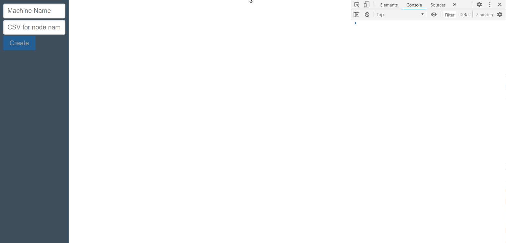

# About

Simple package that handles simplistic states machines as a state machine flow using jointjs.

# Installation

`npm install --save --scope @gentunian --registry https://npm.pkg.github.com @gentunian/jointjs-state-machine`

# How to use

## Quickstart

Import `dist/bundle.js` into the browser and call `createMachineStatePaper()` function, for example, this `index.html`:

```html
<!doctype html>
<html>

<head>
    <meta charset="utf-8">
    <meta http-equiv="X-UA-Compatible" content="IE=edge">
    <meta name="viewport" content="width=device-width,initial-scale=1.0">
    <title>Quickstart</title>
    <link href="./bundle.js" rel="preload" as="script">
</head>

<body>
    <script>window.createMachineStatePaper("");</script>
    <script src="bundle.js"></script>
</body>

</html>
```

Then, use the window message API in the browser console:

```javascript
// create a machine called luke
window.postMessage({id: "luke", command: "create"}})

// initialize luke's machine with nodes, A, B, C
window.postMessage({id: "luke", command: "initialize", data: {nodes:[{name: "A"}, {name: "B"}, {name: "C"}]}})

// start luke's machine. This will advance to node 'A'.
window.postMessage({id: "luke", command: "start"}})

// advance to next node B leaving A in OK status:
window.postMessage({id: "luke", command: "next"}})

// advance to next node C leaving B in ERROR statuS:
window.postMessage({id: "luke", command: "next", data: {error: "some error here!"}}})

// advance to next but there's no more nodes so luke's machine will be in DONE status.
window.postMessage({id: "luke", command: "next"}})
```

## Insights

The function:

```typescript
createMachineStatePaper = (
    elementId?: string,
    api?: MachineApi<CellDataNode>,
    $window: Window = window
)
```

is exported into the browser [`window`](https://developer.mozilla.org/en-US/docs/Web/API/Window) object. All arguments are optional.

* `elementId` (optional): If you want to wrap it into a custom `div` then you should pass the `id` attribute.
* `api` (optional): is a [`windos.postMessage`](https://developer.mozilla.org/en-US/docs/Web/API/Window/postMessage) API that handles [`MessageEvent`](https://developer.mozilla.org/en-US/docs/Web/API/MessageEvent) by default. You may implement an API that extends [`MachineApi`](./src/api/machine-api.ts).
* `$window` (optional): defaults to `window`. You should not require to set this argument, but it's useful while testing :).

# API

## MachineApi

`MachineApi` manages [`StateMachine<T extends CellDataNode>`](./src/state/machine.ts) objects wrapping and proxying method to it. Basically, allows to manage a collection of machines and to notify subscribers about machine state data.

`MachineApi` extends a custom and simple observable pattern (no need to use rx/js yet) and uses generics to holds data nodes type information.

`MachineApi` has the following methods inherited from [`Observable`](./src/utils/observable.ts):

* `notify(data: MachineApiEvent<T>[])`: inherited by the observable pattern, this method notifies subscribers about particular `MachineApiEvent`
* `subscribe(callback: (data: MachineApiEvent<T>) => void)`: subscribers an observer to be notified about `MachineApiEvent`.

And all following methods, that notifies subscribers:

* `create(id: string): StateMachine<T>`: creates a machine with id `id` and returns it. Machines only exists if they are created. It can't be created a machine with a name that already exists.

* `initialize(id: string, data: MachineApiData<T>)`: initializes machine `id` with `data`. A machine cannot be initialized twice. `data` is an array of `T extends CellDataNode` objects, also called nodes. A machine consists of a series of nodes in sequence that are traversed with `next()`. Machine is set to `State.Ready`.

* `start(id: string)`: starts machine `id`. Starts is a particular `next()` that advance the machine to the first node. It cannot be called if machine was not initialized and it cannot be called twice for a particular machine `id`. Machine is set to `State.Running`.

* `next(id: string, data?: MachineApiData<T>)`: advance the machine `id` to the next node. If `data.error` is set, then the current node is set to `State.Error`. Otherwise, it is set to `State.Done`. `next()` can only be called if machine is in `State.Running`. Machine state is set to `State.Done` if the current node was the last one.

* `stop(id: string, data?: MachineApiData<T>)`: stops machine `id`. If `data.error` is set, the current node is set to `State.Error`. Otherwise, it is set to `State.Done` and the machine is set to `State.Stopped`.


## Extending `MachineApi`

The following is an example and actual code used by the project:

```typescript
/**
 * A message handled into `window.postMessage` has the following type:
 */
export interface WindowMessageApiMessage<T extends DataNode> {
    id: string;
    command: MachineApiEventName;
    data?: MachineApiData<T>;
}

/**
 * Transport based on window messaging (`window.postMessage`) capability.
 */
export class WindowMessageApi<T extends DataNode> extends MachineApi<T> {

    constructor(window: Window) {
        super();
        const handleEvent = (event: MessageEvent) => {
            const message = event.data as WindowMessageApiMessage<T>
            if (this[message.command]) {
                this[message.command](message.id, message.data)
            } else {
                console.error(`WARN: No handler for command '${message.command}'. `)
            }
        }
        window.addEventListener("message", handleEvent);
    }
}

```

In this case, the API is extended to create a transport client based on messaging window capabilities. It uses [`window.addEventListener()`](https://developer.mozilla.org/en-US/docs/Web/API/EventTarget/addEventListener) to attach to `MessageEvent` events being published by `window.postMessage()` method, and no further tweaking was needed.

So, if you want to connect your machine API to webworkers, events, reactive data or another kind of source, you may extend `MachineApi` with your needs.

# State Machine Paper

The state machine paper is an orchestrator of machines, API, the drawing and a done strategy. It glues all the thing together to show a `StateMachine` that is managed by a `MachineApi` within a `joint.dia.Paper` inside the HTML.

It can be customized with a custom `MachineApi` and a custom done strategy.

State machine paper shows the machines states as a whole and has it's current internal global state based on machines local state that is calculated by a done strategy.

## Done strategy

Done strategy is no more than a fancy name for a custom object that has 2 callbacks: `local` and `global`.

### Local done strategy
`local` callback is called when a machine is _done_, i.e, its state is `State.Done` or `State.Stopped`. It's responsible of returning the _local_ status for the correspondent machine based on the current states of its nodes. This is because a machine has no error state.

A machine only traverses through nodes and it may be ready, running, stopped or done. Is up to this _algorithm_ to calculate the desired _local_ state of the machine based on the final state of each node. For example, a machine may be considered to be in error if all of its nodes are in `State.Error` when the machine has either stopped or done. Or, a machine may be considered to be in error if at least 1 node is in error when the machine has finished traversing all nodes. Or even more, the machine with id `Windows` is always on error state. This is called _local done strategy_ in this project.

By default, the local done strategy considers that if there are 1 node in `State.Error` then the machine is in error:

```typescript
 local: (id: string, machine: MachineStateData<CellDataNode>): State => {
    if (machine.state === State.Stopped || machine.state === State.Done) {
        return (machine.nodes.filter(n => n.state === State.Error).length > 0) ? State.Error : State.Done;
    } else {
        return State.Running
    }
}
```

### Global done strategy

This sums up all the states and returns the global outcome of each state machine. Every time a machine goes to done/stopped, its local done strategy is invoked and after that, the global done strategy is calculated. Following the same principle as above, a global done strategy may be considered an error if each local machine states are in error.

This callback receives the current local states array, and the default gloabl done strategy is:

```typescript
global: (states: State[]): State => {
    return states.reduce((p, c) => (p === State.Running || p === State.Error && c !== State.Running) ? p : c, State.Done);
}
```

That says that if there are running machines then keep it that way, that is, the global state is `State.Running`. If all machines has finished and there is at least 1 error, then the global state is `State.Error`. If all machines has finished and no error states, then the global state is `State.Done`.

# Sample

An ugly, quick, vague and poorly demonstrative [sample](./sample/index.html) is included in a single HTML file.

### Simple machine


### Multi machine
